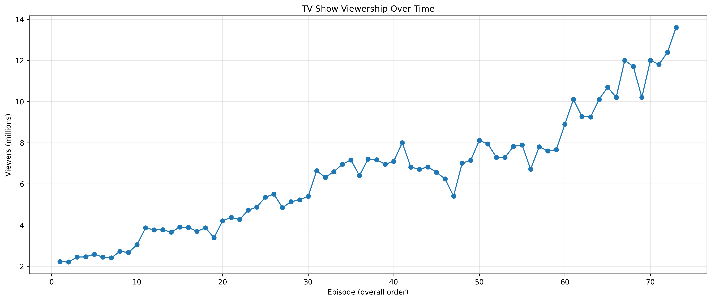

```{r}
library(readr)
library(dplyr)
library(knitr)
library(ggplot2)

tv <- read_csv("/Users/emma/RRcourse2026/RRcourse2026/Week8-MD and Quarto/Assignment_Game_of_Thrones/data/viewership_cleaned.csv")
summary_stats <- read_csv("/Users/emma/RRcourse2026/RRcourse2026/Week8-MD and Quarto/Assignment_Game_of_Thrones/data/summary_stats.csv")
season_summary <- read_csv("/Users/emma/RRcourse2026/RRcourse2026/Week8-MD and Quarto/Assignment_Game_of_Thrones/data/season_summary.csv")

first_episode <- tv[1, ]
last_episode <- tv[nrow(tv), ]

highest_episode <- tv %>% 
  filter(viewers == max(viewers, na.rm = TRUE)) %>% 
  slice(1)

lowest_episode <- tv %>% 
  filter(viewers == min(viewers, na.rm = TRUE)) %>% 
  slice(1)

largest_increase <- tv %>% 
  filter(change_from_previous == max(change_from_previous, na.rm = TRUE)) %>% 
  slice(1)

largest_drop <- tv %>% 
  filter(change_from_previous == min(change_from_previous, na.rm = TRUE)) %>% 
  slice(1)

avg_viewers <- mean(tv$viewers, na.rm = TRUE)
overall_change <- last_episode$viewers - first_episode$viewers
```


# Introduction
This report examines the episode-level viewership trends of Game of Thrones, one of the most commercially successful television series of the 2010s. The analysis focuses on how audience size changed over the full run of the show, using episode-level data across all eight seasons.

# Overview
Game of Thrones is a fantasy drama television series based on George R. R. Martin’s A Song of Ice and Fire novels. The show follows multiple rival houses competing for political power in the fictional continents of Westeros and Essos. Over time, the series became one of the most widely watched and culturally influential television productions of its era.


# Basic Statistics
The table below summarizes the overall viewership pattern across all episodes.
```{r}
kable(summary_stats, caption = "Overall viewership summary statistics")
```

# Viewership Over Time
The first figure shows how episode-level audience size changed throughout the series.
The line chart indicates a strong long-run upward trend in audience size. Although viewership fluctuated from episode to episode, the overall direction was clearly positive, especially in the later seasons.


# Episode-to-Episode Change in Viewership
The second figure presents the change in audience size from one episode to the next.
This chart highlights that while the series gained viewers overall, short-term movements were volatile. Some episodes generated strong gains in attention, whereas others were followed by noticeable declines.

# Average Viewership by Season
To better understand the broader trend, the next figure summarizes average viewership at the season level.
```{r}
ggplot(season_summary, aes(x = season, y = avg_viewers)) +
  geom_line() +
  geom_point() +
  labs(
    title = "Average Game of Thrones Viewership by Season",
    x = "Season",
    y = "Average viewers (millions)"
  ) +
  theme_minimal()
```

The season-level averages show that audience growth was not limited to a few isolated episodes. Instead, the show built and maintained larger audiences over time, with particularly strong growth in Seasons 7 and 8.

# Interpretation

The viewership of *Game of Thrones* shows a strong upward trend across the series, despite several short-term fluctuations between episodes. The first recorded episode attracted `r round(first_episode$viewers, 2)` million viewers, whereas the final episode attracted `r round(last_episode$viewers, 2)` million viewers, representing an overall increase of `r round(overall_change, 2)` million viewers.

Across all episodes, the average audience size was `r round(avg_viewers, 2)` million viewers. The highest viewership was recorded for *`r highest_episode$title`* (Season `r highest_episode$season`, Episode `r highest_episode$no_season`), which reached `r round(highest_episode$viewers, 2)` million viewers. By contrast, the lowest audience was observed for *`r lowest_episode$title`* (Season `r lowest_episode$season`, Episode `r lowest_episode$no_season`), with `r round(lowest_episode$viewers, 2)` million viewers.

The largest episode-to-episode increase in audience size was `r round(largest_increase$change_from_previous, 2)` million viewers, observed for *`r largest_increase$title`*. The sharpest decline was `r abs(round(largest_drop$change_from_previous, 2))` million viewers, observed for *`r largest_drop$title`*. Overall, the data suggests that the series gained substantial popularity over time, even though audience changes at the episode level remained uneven.

# Conclusion
This report shows that Game of Thrones experienced substantial audience growth over the course of its run. While episode-level changes were sometimes volatile, the long-term pattern was clearly upward. The combination of rising season averages, a much larger finale audience, and repeated spikes in later seasons indicates that the show expanded its reach significantly as it progressed.